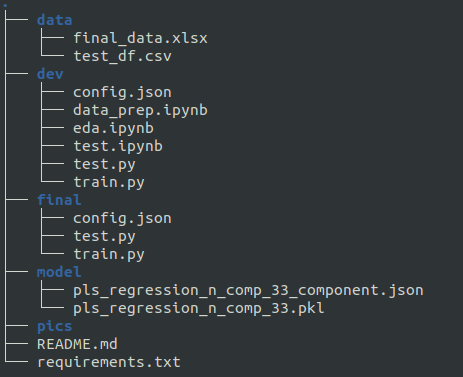

# nir_rnd
Some R&amp;D related to NIR-spectroscopy data

## Regression on NIR-spectroscopy data
The data is generated artificially with some Y axis values

<b>Python version: 3.12.4</b>

<b> Required Environment:</b>
```
anaconda3 (python virtual environment might also suffice; not tested)
numpy==2.0.0
pandas==2.2.2
scikit_learn==1.5.1
scipy==1.14.0
matplotlib==3.9.1
openpyxl==3.1.5
ipython==8.12.3
```
After installing anaconda3 or python virtual environment, to install the dependencies run:
```
pip install -r requirements.txt
```

### Directory Structure



### Data and Process Short Description
The data has around 258 dimensions including the Y-axis
Suitable for regression task can also be approximated and used for classification tasks.

<b>PLS Regression is used and the parameters are:</b>
```
minimum wave lenght for smoothing: 80,
maximum wave lenght for smoothing: 257,
window size: 21,
degree of freedom: 0,
degree for polynomial: 2
```

For smoothing Savitzky-Golay filter is used by analysing Fast Fourier Transformation.

For outlier detection, T^2 and PLS Regression's loading matrices are analysed

### For source data, contact at: mahmudulhaquearfan@gmail.com